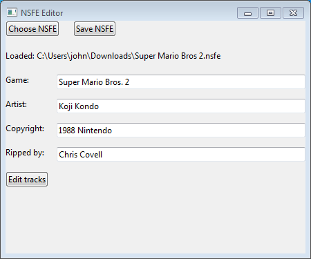
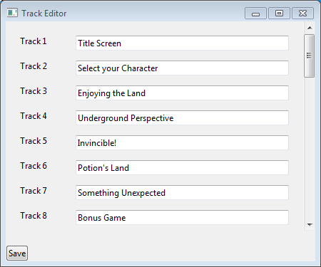

# NSFE Tag Editor

Just a dumb lil' tool for editing the tags of an NSFE file.

## Downloads

See the [releases tab](https://github.com/jprjr/nsfe-editor/releases)

## Screenshots

The main editor:

The track title editor:

## LICENSE

MIT License (see `LICENSE`)

Portions of `nsfe-editor.lua` contain `struct.lua`,
from https://github.com/iryont/lua-struct -- this is also MIT-licensed.

Its license is included in `nsfe-editor.lua`.
